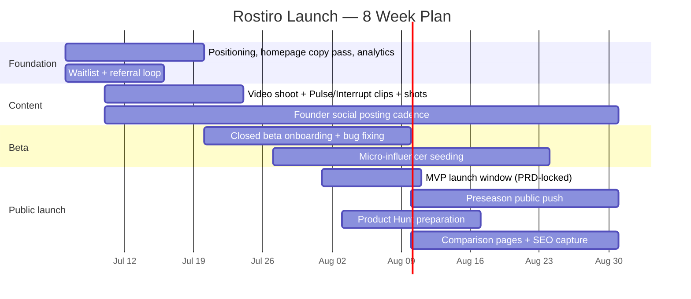

# Rostiro Marketing Plan v1.0
## Adapted from ChatGPT/Gemini competitive research, aligned to the actual product (PRD v5, brand kit v1.0)

> Source strategy: `CHATGPT Marketing.md` (external research, dated July 6, 2026). This document keeps that plan's strategy and channel logic — which is sound — and corrects feature names, pricing, and asset status against what's actually built, per `Rostiro_PRD_v5.md` and `rostiro-brand-kit.md`.

---

## 0. What changed from the source plan, and why

| Source plan said | Actual product | Fix applied here |
|---|---|---|
| "Adaptive Weekly Cycle" | **Rostiro States** — Draft / Standard / Waiver Day / Game Day / Film Room (PRD §6.10), each with its own brand-kit pulse color, amplitude, and cycle speed | Renamed everywhere below. This is also the strongest visual asset in the plan — the pulse mark literally changes color/shape per state, which is a ready-made animation. |
| No mention of Health Score | League Health Score (PRD §6.2) — always-on 0–100 dashboard signal, gives the app a reason to open even with no active decision | Added to the differentiator list and asset table. |
| Generic "free plan" | **Free / Rostiro Pro $9.99mo / 2026 Founder Season Pass $59 / Founding 500 $149 lifetime, capped at 500** (PRD §9) | Folded the Founder tiers' hard scarcity (capped, launch-window-only, never returns) directly into the launch-wave messaging — it's a stronger urgency mechanic than anything generic the source plan proposed. |
| "Casual / Savant / Commissioner" segments | Product Modes are **Focused / Balanced / Savant** (density, chosen at onboarding) — a different axis from *who* the user is | Kept the three market segments (they're a real targeting lens) but noted explicitly that they map to Modes, not equal them: a casual manager will typically pick Focused, a grinder will pick Savant, and Commissioner is a role, not a Mode. |
| Generic "demo video" / "screenshots" asset asks | `ProductVideoDemo.tsx` already built with 3 shot-listed slots; `DataJoinDiagram.tsx` already shipped (Savant-facing, not a marketing hero visual) | Replaced generic asset asks with what's actually outstanding — see §5. |

Everything else — the category-first positioning, the three-wave launch calendar, the channel priority table, the Product Hunt checklist, the defensibility notes — I agree with as written and kept intact.

---

## 1. Positioning (unchanged strategy, corrected names)

**Headline:** Rostiro is the operating system for fantasy football.

Not "AI fantasy assistant" — that space is crowding fast (STACKED, Yahoo's "Assistant GM"). The OS frame is what's actually differentiated: cross-platform sync + a ranked cross-league action list + a cockpit that reconfigures itself around the calendar + a disciplined single-interrupt model.

**Taglines (pick one for launch, keep others for testing):**
- Run every league from one command center. *(matches the existing brand-kit tagline "RUN EVERY LEAGUE" — recommend leading with this one for consistency with the wordmark)*
- The operating system for fantasy football.
- One screen for what actually matters.

**True differentiators to headline** (own these, don't lead with parity claims):

| Feature | What it actually is | Why it's the hero |
|---|---|---|
| **Pulse** | Ranked, cross-league action list — replaces app-switching | "Check Rostiro first" habit loop |
| **Rostiro States** | Automatic cockpit reconfiguration: Draft → Standard → Waiver Day → Game Day → Film Room, on a schedule every user shares | No competitor describes a system that changes its whole shape by day/week — this is the most brandable, most visually demoable idea in the plan |
| **Game Day Mission Control** | Live-Sunday screen, roster-relevant filtering across every connected league | Best visual demo asset |
| **Interrupt Stack** | Only the highest-priority event interrupts; everything else waits in a queue | Concrete, memorable, one-clip-explainable |
| **League Health Score** | Always-on 0–100 signal per league | Gives the app a reason to open on a quiet Tuesday, not just during a crisis |

Parity features (cross-platform sync, AI advice, mobile-first, free plan) still need to work, but shouldn't be the headline — everyone in the category claims them.

**Segments** (kept from source plan, mapped to actual product axes):

| Segment | Pain | Message | Rostiro Mode they'll likely pick |
|---|---|---|---|
| Casual managers | Too much noise, no homework wanted | "Open Rostiro and do the next right thing." | Focused |
| Savants / grinders | Fragmented exposure across hosts/leagues | "Manage your teams like one portfolio." | Savant |
| Commissioners | Want a sharper game-day experience for their league | "Give your league a smarter game-day command center." | Balanced or Savant (role, not a Mode) |

---

## 2. Pricing as a launch mechanic (new — not in the source plan)

The source plan recommends scarcity/gated-beta as a defensibility tactic. Your actual pricing already has that scarcity built in — this should be a marketing centerpiece, not a Stripe implementation detail:

- **2026 Founder Season Pass — $59.** Full Rostiro Pro for the season. Launch-window pricing, never offered again once the window closes.
- **Founding 500 — $149 lifetime.** Strictly the first 500 users. Founder badge, priority feedback access, early feature previews. Never returns once sold out.

This gives every early social post and waitlist email a genuine, non-manufactured urgency hook ("first 500, ever") that most SaaS launches have to fake. Recommend the homepage hero and the first founder-led social clips explicitly name the Founding 500 cap and a live counter ("X of 500 claimed") once Stripe/T-85 is wired up.

*Open question carried over from the PRD, flagged there as a business decision: whether Free settles to the limited tier after the 7-day trial, or stays generous forever. This affects upgrade-pressure messaging — resolve before writing final pricing-page copy.*

---

## 3. Launch calendar (aligned to the PRD's actual MVP date)

The source plan's calendar (built July 6, 2026) already lines up well with the PRD's own launch target of **August 1–10, 2026** ("before first major fantasy drafts," PRD §1). No date conflicts — keeping the three-wave structure:

Football calendar context (unchanged from source): NFL preseason opens Aug 6, preseason slate runs Aug 13–29, regular season opens Sept 9. The window between now and late August is the entire acquisition opportunity before Week 1 lock-in.

---

## 4. Channel plan (kept from source, no changes needed)

| Channel | Priority | Timing |
|---|---|---|
| Founder-led demo posts (X/TikTok/Reels) | Very high | Start this week |
| Waitlist with referral loop, naming Founding 500 scarcity | Very high | Start this week |
| Reddit posting/comments | Very high | After 1–2 strong demo clips exist |
| Closed beta (TestFlight/Android) | High | Late July |
| Micro-influencer seeding | High | Late July–August |
| Public preseason push | High | Aug 10–30 |
| Product Hunt | Medium | Once usable + polished |
| Paid ads | Low, deferred | Only after organic message/creative prove out |

Social hooks (kept as-is, they're good and don't need product-name corrections):
- "I was tired of opening four fantasy apps every Sunday, so I built one screen that only tells me what matters."
- "Most fantasy apps show scores. Rostiro shows which play actually changed your week."
- "If you play in multiple leagues, you don't have multiple teams — you have one portfolio."

---

## 5. Asset production — actual outstanding work (replaces the source plan's generic list)

This is the part that's specific to your repo right now, as of July 6, 2026:

### Copy cleanup — ✓ Done (2026-07-06)
- [x] `app/page.tsx` — em-dashes removed from visible copy and comments
- [x] `app/privacy/page.tsx` — full page cleaned
- [x] `app/(auth)/signup/page.tsx` — cleaned
- [x] `app/(auth)/onboarding/page.tsx` — cleaned
- [x] `app/layout.tsx` page-title metadata and `components/marketing/PublicHeader.tsx` comment — caught in the same pass
All public marketing/auth surfaces confirmed em-dash-free by grep. (Internal authenticated dashboard pages and API/lib code comments still have them — that's a separate, larger product-wide style task, not a marketing one, deliberately left alone.)

### Marketing hero visuals — ✓ Done (2026-07-06)
Built as real code components (not screenshots/illustrations), matching the site's existing `DataJoinDiagram.tsx` / `InteractivePulseDemo.tsx` pattern, wired to `brandTokens.ts` / `rostiroState.ts` so they can't drift from the product:
- [x] `components/marketing/OldWayVsRostiro.tsx` — four scattered app cards collapsing into one Pulse card, homepage `ProblemSection`
- [x] `components/marketing/RostiroStatesCycle.tsx` — animated 4-node weekly loop (Game Day → Film Room → Waiver Day → Standard) plus a Draft preseason chip, using the real `STATE_CONFIG` colors/timing, homepage `StatesSection`
- [x] `components/marketing/InterruptStackDemo.tsx` — interactive touchdown-simulation + persistent lineup-lock demo, Features Pillar 3, styled identically to the real `InterruptStack.tsx`
- [x] `components/marketing/CrossLeagueExposure.tsx` — one player, three league badges, combined point exposure, Features Pillar 1
All four type-checked, lint-checked, and confirmed working live in the browser (touchdown simulate/auto-dismiss, states cycling, mode-density switching all verified interactively).

### Video shoot — DEFERRED, requires the founder to film
**Full beat-by-beat script for all three clips lives in `Rostiro_Video_Shotlist.md`** (shot setup, exact timing, what must be on screen, non-negotiables per clip) — this is the shoot-day reference. None of this is buildable by Claude Code: two clips require a real live NFL Sunday, all three require the founder's real connected Sleeper/Yahoo/ESPN accounts.

**Placeholder update (2026-07-06):** all three `ProductVideoDemo` slots on the Features page are now filled with real rendered `.mp4` placeholders (`public/videos/`), built with Remotion (`remotion/` directory, installed as a dev dependency) instead of the bare "Demo coming soon" state:
- **Kickoff transition** and **Interrupt Stack** clips are motion-graphic recreations built directly from the real `brandTokens.ts` colors and real `STATE_TRANSITION_MS`/`AUTO_DISMISS_MS` timing — accurate to actual product behavior, captioned "recreation, real footage pending."
- **Multi-league connect** clip is a staged reenactment with placeholder account names (can't authentically fake real OAuth), permanently watermarked on-screen "ILLUSTRATIVE REENACTMENT — NOT REAL ACCOUNT FOOTAGE."

This does not change the DEFERRED status of the real shoot — the placeholders exist so the page isn't empty, not as a substitute. Once real footage is shot, swap the `src` prop at each `ProductVideoDemo` call site and delete the Remotion compositions.

Rough placeholder GIFs from an earlier pass (screen-recorded from the live dev site) still exist for internal review only: `rostiro-interrupt-stack-demo.gif`, `rostiro-states-cycle-demo.gif`, `rostiro-mode-density-demo.gif` — superseded by the Remotion renders above for on-site use.

---

## 6. Metrics (kept from source plan, no changes)

Acquisition (visitor→signup), activation (signup→install), core setup (account→first league connected), time-to-value (signup→first Pulse view), Thu–Mon DAU/WAU engagement, Sunday session frequency, Week1→Week2 retention, push opt-in rate, avg. leagues connected per user, referral invites per activated user.

---

## 7. First two weeks — concrete order

1. Em-dash cleanup pass (4 files above) — trivial, do today.
2. Lock homepage hero copy around Pulse + Rostiro States, name the Founding 500 cap explicitly.
3. Schedule the video shoot (3 slots, shot list already written — this is a founder-time booking, not a creative-brief problem).
4. Instrument analytics for the funnel in §6.
5. Waitlist + referral loop live, Founding 500 counter once Stripe (T-85) is wired.
6. Cut the 3 shot clips into 15-30s social versions once shot.
7. Start founder-led posting cadence on X/TikTok using those clips.
8. Recruit first 25-50 beta users manually.
9. Build the "old way vs. Rostiro" and 5-state animation visuals (design work, can run in parallel with the shoot).
10. Draft one comparison page ("Rostiro vs. FantasyPros") framed as system-layer vs. analyst-layer.

---

*This plan should be treated as a living doc alongside the PRD — update it as the em-dash/diagram/video items above get closed out, and as the Free-tier-after-trial pricing decision gets made.*
