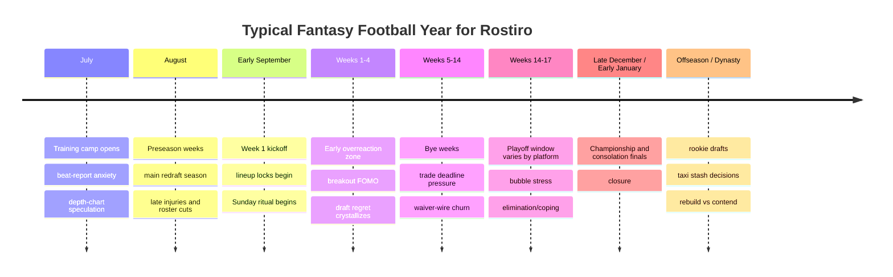

# Rostiro Emotional Calendar Report

## Executive summary

Fantasy football already has a stable behavioral rhythm. Managers do not experience the game as one continuous product session; they move through a repeating calendar of anticipation, anxiety, reaction, recovery, and renewed optimism. The public evidence is unusually consistent on this point. NFL training camp begins in late July, preseason spans August, the regular season runs 17 games across 18 weeks with one bye, and fantasy platforms layer their own cadences on top of that structure through drafts, waivers, lineup locks, playoffs, and consolation play. ESPN’s standard playoff setup starts in NFL Week 14 and uses two-week rounds unless a league manager changes it, while Yahoo explicitly allows multiple playoff-week configurations, which means Rostiro cannot hard-code one “correct” fantasy postseason. citeturn13search0turn13search1turn12search7turn24view0turn2search10

The strongest product implication is that Rostiro should not be designed as a generic dashboard. It should be designed as a calendar-aware operating system with different behavioral modes. Existing platforms already optimize for alerts, live play-by-play, live scores, lock-screen activities, and even TV viewing companions, but their public product language still centers on transactions, alerts, and repeated check-ins. Sleeper calls its GameDay experience a differentiator and ritualizes Tuesday waivers; Yahoo has introduced Fantasy Feed and lock-screen Live Activities; ESPN now supports a living-room score view on smart TVs that is explicitly “strictly for viewing matchup scores.” The opportunity for Rostiro is not to invent the second screen, but to unify it into a calmer, more portfolio-aware, more emotionally intelligent Sunday state. citeturn18view4turn18view3turn18view2turn20view0

That second-screen behavior is real and already culturally normalized. Google reported that 77% of people watch TV with a laptop, phone, or tablet nearby, especially during big televised events; sports-specific reporting citing Sports Business Institute research puts second-screen usage among sports fans at 87%; and eMarketer forecasts 216.8 million U.S. adults will use a smartphone as a second screen in 2026. Research on sports spectatorship also shows that second-screen usage complements, rather than replaces, the primary broadcast. Rostiro should therefore assume that football remains the first screen and position GameDay Console as the portfolio-filtered companion to the game. citeturn22search14turn22search0turn22search2turn22search1

The emotional design constraint is equally clear: do not fight for attention the way a social app or sportsbook does. Research on interruptions and notifications shows that unnecessary interruptions raise cognitive load and strain, while carefully managed ambient information and peripheral displays can support awareness with less disruption. Academic work on fantasy football further suggests that more intense engagement, frequent checking, social comparison, and higher financial involvement correlate with both stronger positive mood and more mental-health concerns; experienced players are generally less anxious than newer ones. Rostiro should therefore separate **Pulse** and **GameDay Console** as two distinct interaction models: Pulse is for action and decision support; GameDay Console is for glanceable situational awareness with tightly rationed interruptions. citeturn5search0turn4search2turn23search2turn23search14turn11search0turn11search1turn21search16

The commercialization implication follows from behavior, not from feature count. The emotional moments people will pay for are the ones that collapse anxiety and context-switching: Sunday live portfolio awareness, high-confidence injury handling, decisive waiver moments, lineup-clarity near kickoff, and playoffs/championship recaps that feel ceremonial. Free should deliver trust through basic Pulse and light alerts. Paid should unlock the weekly ritual: **GameDay Console**, deeper player intelligence, richer halftime/final recaps, portfolio-level projections, and multi-league orchestration. The most important KPIs are not only conversion and retention, but **Console entry rate**, **average Console time**, and **second-screen hours per active user per Sunday**. Those are the measures that indicate Rostiro has become part of the weekly football ritual rather than another app that gets checked and closed. citeturn20view0turn18view4turn18view3turn9search0

## Season flow and calendar logic

The NFL calendar dictates the emotional calendar, but fantasy overlays distinct pre-draft, draft, live-season, and playoff states. For redraft, the high-intensity period usually begins with training-camp beat reports in late July, spikes through August drafts and preseason uncertainty, then settles into a Tuesday-to-Monday loop during the regular season. For dynasty, that loop begins earlier and never fully ends because rookie drafts, taxi-squad decisions, and year-round trades keep the offseason emotionally “alive.” Sleeper’s public docs reflect that difference directly: dynasty keeps the entire roster, includes rookie drafts and taxi squads, and is framed as the closest thing to a GM experience. citeturn13search0turn13search1turn13search5turn6search13turn6search1turn13search2

The platform-layer calendar matters because “playoffs” are not uniform. ESPN standard settings begin in Week 14 and each round spans two weeks unless customized. Yahoo offers Weeks 14–16, 15–17, or 16–18 as playoff options. Sleeper highlights customizable playoff settings and explicitly notes that some leagues prefer Weeks 16–17 only, while others use other structures. Rostiro should therefore treat postseason timing as a league-specific variable rather than a global state. citeturn24view0turn2search10turn2search5

The weekly in-season rhythm is already described plainly by Yahoo’s sports president: Tuesday is postmortem and waiver setup, Wednesday is waivers, and Thursday through Monday is lineup tinkering plus repeated score checks. Reddit discussion reinforces the same pattern from the user side: Sunday is anxiety, refresh behavior, and split attention; Tuesday is FAAB panic, regret, and opportunism; bye weeks trigger bench stress and hard cuts; and elimination/championship weeks produce especially intense coping and celebration threads. citeturn20view0turn16search14turn16search2turn8search1turn8search7turn8search9

### Recommended season states for Rostiro

| State | Relative timing | Primary emotion | Primary job to be done | Product mode |
|---|---|---|---|---|
| Offseason Watch | Post-title to training camp | Distance, curiosity, dynasty itch | Light monitoring, rookie/keeper context | Low-frequency Pulse |
| Camp Watch | Late Jul to mid Aug | Anticipation, uncertainty | Beat reports, depth charts, injury context | Pulse + Draft Prep |
| Draft Mode | Main drafts, usually Aug to early Sep | Time pressure, optimism | Narrow the board, reduce regret | High-action Draft Mode |
| Pre-Kickoff Weekly Prep | Thu to Sun pre-lock | Anxiety, decision fatigue | Start/sit clarity, inactive risk | Pulse |
| GameDay Console | Sunday early/late windows | Elation, dread, obsession, ritual | Glanceable live awareness | Ambient live mode |
| Prime-Time Lite | Thu night / Mon night | Residual suspense | Focused matchup tracking | Reduced-intensity live mode |
| Waiver Window | Mon night to Wed | Panic, opportunism, FOMO | Claims, FAAB strategy, roster churn | Action-heavy Pulse |
| Film Room | Mon-Tue and after games | Regret, rationalization, insight | Explain what happened and what to do next | Reflective analysis |
| Playoff Pressure | League-specific | Stress, hope, grief | Avoid mistakes, maximize certainty | High-confidence Pulse + Console |

This table is a design synthesis from official league/platform schedules and user discourse rather than a claim that every league behaves identically. The non-negotiable design lesson is that Rostiro should be **stateful**. A static interface will under-serve the emotional year. citeturn13search0turn24view0turn20view0turn6search13turn9search0

## Emotional event taxonomy

The table below is the core mapping for product design. Intensity is a product-design scale, not a clinical one. Duration is the window during which the feeling typically remains salient enough to justify UI treatment.

| Emotion event | Typical trigger | Typical duration | Intensity | Frequency | Recommended Rostiro signal |
|---|---|---:|---|---|---|
| Predraft nerves | Draft order set, rankings conflict, clock anxiety begins | 1–7 days pre-draft | Medium | Annual; higher in each league | Calm prep checklist, “known unknowns,” confidence meter on queue |
| Draft clock stress | Less than 60s on the clock, tier break approaching, player sniped | Seconds to minutes | High | Every draft round | Tight timer, tier-preserving alternatives, no flashy motion |
| Post-draft rosterbation | Draft ends, lineup looks “stacked,” projections look good | Hours to days | Medium | Annual | Hero card, portfolio snapshot, soft celebratory glow, share card |
| Immediate draft regret | News breaks, injury context clarifies, missed pick becomes obvious | Hours to 1 week | High | Annual; common | “It’s early” reframing, replacement paths, avoid doom language |
| Preseason uncertainty | Camp injuries, ambiguous depth chart, roster cuts | Days to weeks | Medium | Annual | Pulse summary: “what changed,” “who gained,” “what to ignore” |
| Week 1 overreaction | Star dud, surprise waiver gem, breakout performance | 24–72 hours | High | Annual spike | Film Room explanation and anti-panic prompts |
| Sunday touchdown elation | Your player scores or hits a meaningful milestone | 5 seconds to 1 hour | High | Many times per season | Impact card, brief accent animation, projection swing, auto-dismiss |
| Opponent surge despair | Opponent player scores or your win probability sharply drops | 30 seconds to 1 day | High | Many times per season | Calm loss-context card, remaining outs, no red flash spam |
| Injury shock | Starter ruled out, leaves game, limited status changes late | Minutes to days | High | Persistent season-wide | P0 alert, backup/waiver implication, next decision window |
| Late inactive panic | Inactives list or beat report makes lineup unsafe near lock | 5–60 minutes | High | Weekly risk | Critical pre-lock warning with direct action path in Pulse |
| Waiver-wire panic | Surprise role change, injury, breakout, FAAB uncertainty | 6–24 hours | High | Weekly | Waiver shortlist, bid ranges, scarcity badge, countdown ritual |
| Trade elation / anxiety | Offer arrives, trade accepted, league reaction follows | Minutes to days | Medium-High | League-dependent | Trade-impact card, role changes, short “what this did” explainer |
| Breakout surprise / FOMO | Bench player or waiver player hits, league mates notice first | Hours to days | Medium-High | Weekly | “You missed / still recoverable” framing with next-best alternatives |
| Bust realization | Underperformer crosses from “hold” to “revalue” | 2–4 weeks | Medium | Several each season | Film Room turning-point analysis, bias check, avoid shame language |
| Bye-week stress | Too many byes, thin bench, painful drops | 1–7 days | Medium | Weeks 5–14 | Bye-week planner, replace/hold matrix, bench compression warning |
| Bubble-week dread | Win-and-in or lose-and-out scenario | 3–7 days | High | Late season | Standing scenarios, matchup leverage, emphasize controllables |
| Playoff euphoria / grief | Semifinal swing, elimination, upset, finals entry | Hours to 1 week | High | Annual | Ceremony cards, bracket shifts, dignified coping or celebration |
| Championship result | Title win/loss finalizes the season | Days to offseason | Very High | Annual | End-state ritual: trophy or respectful closeout, season story recap |

This taxonomy is grounded in three kinds of public evidence. First, fantasy managers publicly name and ritualize these moments: “rosterbation” threads, draft-regret threads, panic/cope threads, injury-alert scramble discussions, bye-week management posts, elimination coping threads, and championship nerves are all recurring genres on r/fantasyfootball and r/DynastyFF. Second, platform docs show that major products already optimize around exactly these emotional windows: Sleeper explicitly ritualizes Tuesday waivers and differentiates GameDay; ESPN and Yahoo emphasize alerts for player status, trades, game status, and live scoring. Third, fantasy-football research finds both social positives and emotional strain, with greater engagement and more frequent checking linked to stronger highs and stronger concerns. citeturn1search4turn14search2turn16search2turn8search1turn8search7turn8search9turn6search11turn18view4turn18view5turn19view0turn11search0turn11search1

### The most valuable emotional windows

Not all events deserve equal investment. The most monetizable and habit-forming windows are the ones that combine high emotion with repeat frequency:

| Window | Why it matters | Best Rostiro response |
|---|---|---|
| Sunday live swings | Highest open-time potential; directly tied to habit | GameDay Console |
| Late inactive / injury windows | Highest urgency; strong trust-builder | High-confidence critical alerts |
| Tuesday waivers | Repeatable ritual; direct action | Rich Pulse + countdown |
| Bubble/playoff weeks | Highest stakes, highest retention risk | Scenario intelligence + calmer copy |
| Championship closeout | Strong memory formation; shareability | Ceremony and season recap |

Sleeper’s own product language around GameDay and Waiver Countdown is instructive here: it is already trying to turn waivers into “a major weekly event.” Rostiro should do the same, but with more portfolio intelligence and less app-hopping. citeturn18view4

## Personas and interaction model

The same event lands differently depending on engagement level, number of leagues, and format type. Research on fantasy-football involvement suggests that experience reduces anxiety on average, while higher engagement, social comparison, and frequent checking intensify both positive mood and mental-health concerns. That means Rostiro should not only personalize content by roster; it should also personalize the **density and intensity** of delivery. citeturn11search0turn21search16

### Persona impact

| Persona | Emotional pattern | Main product risk | Design response |
|---|---|---|---|
| Casual redraft manager | Spikes around draft, Sunday, playoffs; less tolerance for complexity | Overload and churn | Fewer alerts, simpler summaries, one-league defaults |
| Engaged redraft manager | Weekly obsession; high check frequency | Notification fatigue, regret spirals | Richer Console, more advanced thresholds, Film Room explanations |
| Multi-league manager | Conflicting rooting interests, context collapse | Fragmentation across leagues/apps | Portfolio-first summaries, normalized exposure, opponent-aware filtering |
| Dynasty manager | Year-round attachment; rookie fever; long memory of trades | Offseason churn and cognitive overload | Year-round low-frequency Pulse, rookie/taxi/trade states |
| New manager | Higher uncertainty, higher anxiety | Misreading noise as signal | Strong anti-panic copy, confidence labels, basic education in context |
| Veteran manager | Faster pattern recognition, lower baseline anxiety | Annoyance at obvious alerts | Customizable thresholds, compact pro view |

Forum discourse makes the multi-league pain especially explicit: users describe their fun becoming harder to track when they have too many conflicting players across leagues, and Sunday becomes identity-fragmented rather than team-centric. That is precisely where Rostiro’s portfolio lens becomes valuable. citeturn1search7

### Pulse and GameDay Console should be different products

The public product landscape suggests that most existing apps over-index on one interaction pattern: check, tap, transact, dismiss. Rostiro should split its behavior model in two.

| Dimension | Pulse | GameDay Console |
|---|---|---|
| Primary use case | Decision support | Situational awareness |
| Typical timing | Tue–Sun pre-kickoff; Mon recap | Sunday live windows |
| Interaction style | Action-heavy | Glance-heavy |
| Attention mode | Center of attention | Periphery of attention |
| Typical card behavior | Persist until resolved or snoozed | Auto-fade unless urgent |
| Best content | Waivers, lineup clarity, trade explanations, roster health | Live scores, filtered ticker, impact cards, halftime/final recaps |
| Click expectation | Moderate to high | Very low |
| Success metric | Actions completed | Time open with low friction |

This separation aligns with classic notification and peripheral-display research. Notification systems need to trade interruption value against attention cost, and peripheral displays are specifically meant to keep users aware of information without demanding their full attention. Rostiro should therefore treat Sunday as a peripheral-awareness problem, not a task-management problem. citeturn23search0turn23search2turn23search11turn23search20

### Information hierarchy and interruption rules

A practical hierarchy for implementation:

| Layer | Description | Example content | Behavior |
|---|---|---|---|
| Ambient | Always visible, almost never interrupts | ticker, matchup score, sync, live game state | continuous, low-motion |
| Glance | Raises salience but does not demand action | halftime recap, red-zone proximity, projection lean | subtle pulse or slide |
| Interrupt | Personally consequential, time-sensitive | your TD, opponent TD swing, late inactive, in-game injury | card + optional sound |
| Action | Requires user choice | waiver claim, swap starter, accept trade | routed to Pulse, not Console |

Recommended thresholds for the first Rostiro implementation:

| Priority | Trigger proposal | Default treatment |
|---|---|---|
| P0 critical | Starter becomes inactive within 90 min of lock; in-game injury to rostered starter; player-status change that creates immediate action need | Push + in-app card + persistent until seen |
| P1 high | Your player TD; opponent TD; lead flips; projection swing > 8 pts or win probability changes by > 15 percentage points | In-app impact card; optional sound |
| P2 medium | Halftime, game end, red-zone entry for heavily relevant player, waiver-relevant injury elsewhere in league | Console card only; no push by default |
| P3 low | General box-score drift, neutral NFL news, non-portfolio touchdowns | Ticker only |

The design principle should be explicit in code and product review: **if information does not affect the user’s portfolio, opponent, or available-player market, it should usually stay ambient.** This follows both user expectation in fantasy threads and attention-cost research on unnecessary interruption. citeturn16search2turn18view5turn19view0turn19view1turn5search0turn23search18

## Emotional design patterns and high-impact flows

### Patterns to use

Existing product norms and attention research point toward a restrained style rather than a casino style. NFL RedZone’s repeated success came from ceremony, pace, and relevance, not gaudy reward mechanics; academic work on interruptions suggests users benefit when attention is directed only where valuable; and higher levels of constant checking are already associated with more strain among fantasy players. Rostiro should therefore use motion as meaning, not as bait. citeturn9search0turn9search1turn23search0turn11search0

| Pattern | Why it works | Visual suggestion | Spec note for Claude |
|---|---|---|---|
| Ritualized entry | Builds anticipation and habit | 10s pre-kickoff initialization sweep | Trigger once at Sunday entry or 12:59:50 PM ET |
| Breathing sync/status indicators | Signals “alive” without panic | subtle opacity pulse every 2–3s | CSS transform/opacity only; low CPU |
| Single-card interruptions | Preserves calm | one toast slot only, top-right | queue next alert until prior auto-dismisses |
| Soft projection transitions | Prevents score chaos | number tween over 300–500ms | no bouncing counters |
| Contextual color leaning | Conveys mood without flashing | slight warmth when trailing; cooler calm when stable | keep contrast AA-compliant |
| Scheduled recaps | Supports ritual memory | halftime / endgame report | only if user has active players in window |
| Respectful haptics/sound | Makes true moments land | one short chime for P0/P1 only | default off on desktop; remember preference |
| Ceremony cards | Strengthens season memories | title/finals closeout visuals | do not over-animate; preserve dignity |

### Anti-patterns to avoid

| Anti-pattern | Why to avoid it |
|---|---|
| Slot-machine confetti for every score | Feels like gambling UX and will fatigue quickly |
| Red badge spam | Creates attention debt and panic |
| Stacked alerts | Turns live mode into a task queue |
| Interrupting for information already visible | Wastes attention and feels dumb |
| Generic NFL news blasts | Breaks the portfolio promise |
| Excessive sound or crowd-noise cues | Competes with the TV and social setting |
| Dense Sunday navigation | Violates the “glance, don’t manage” principle |

Because financial involvement and frequent comparative checking in fantasy already correlate with stronger concerns, Rostiro should intentionally avoid casino-adjacent reinforcement loops. Premium should come from competence, not compulsion. citeturn21search1turn21search0turn21search16

### Sample event flows and copy

The flows below are intentionally short, implementable, and ranking-aware.

| Moment | Priority | Example copy | Visual / animation | Claude spec |
|---|---|---|---|---|
| Console entry | P1 ritual | **GameDay Console available** → *Synchronizing leagues… Pulse initialized… Mission ready.* | top sweep line; ticker fades in | Sunday only; disabled button before availability |
| Your player touchdown | P1 | **CeeDee Lamb — TOUCHDOWN** · `+8.4 pts` · *You’re now projected to win 3 of 4 leagues.* | impact card slides in, 350ms; accent flash on player chip | auto-dismiss after 4s unless hovered |
| Opponent comeback alert | P1 | **Lead reduced** · *Opponent gained 7.2 pts.* · *You still lead in 2 leagues.* | subtle amber lean, no harsh red | suppress if similar alert fired in last 5 min |
| Injury alert | P0 | **Questionable to return** · *Jonathan Taylor left the game.* · *Two waiver-relevant backups identified.* | card pins until seen; optional sound | deep-link to Film Room / next-action sheet |
| Late inactive alert | P0 | **Inactive risk resolved** · *Your WR is OUT.* · *Swap recommended before 12:57 PM.* | red underline only; no shake | persistent until lineup slot handled |
| Halftime recap | P2 | **Halftime Report** · *Winning 2 | Trailing 1 | Biggest swing: +14%* | center card or side panel expansion | show only once per slate |
| Waiver steal alert | P1 action | **Waiver outcome** · *You won Jordan Mason for $17 FAAB.* · *Beat next bid by $2.* | midnight/waiver ritual card with soft gold accent | route to Pulse; store bid delta |
| Trade accepted | P1 action | **Trade accepted** · *You sent depth, bought certainty.* · *Projected starter count unchanged.* | split-player chips morph | persistent in Pulse until reviewed |
| Bye-week summary | P2 | **Bye Week Pressure** · *4 starters on bye next week.* · *Two cut decisions likely.* | calm slate card; gray/blue palette | generated every Monday if >=3 byes ahead |
| Bubble-week scenario | P1 | **Playoff path** · *Win and you’re in.* · *Lose and you need 18 PF help.* | ladder/standing card | recalc after each relevant game end |
| Championship result win | P1 ceremony | **Champion** · *You finished 11–4 and survived a 0.10 semifinal.* | tasteful gold border; no confetti storm | user can export image/share |
| Championship result loss | P1 ceremony | **Runner-up** · *You were one start away.* · *Season recap ready.* | muted silver/gray; dignified fade | do not use failure language |

These are not just copy samples; they encode the report’s larger rule set. Cards should explain portfolio impact, not merely report raw events. Existing platform docs show that mainstream products already provide alerts and live scores; Rostiro’s differentiation should be that every event answers “what does this mean for me now?” rather than merely “what happened?” citeturn18view5turn18view4turn18view2turn18view3

## Monetization, telemetry, and implementation roadmap

### What should be free and what should be paid

The emotions that justify a paywall are the ones that solve repeated Sunday and Tuesday pain. Casual news, basic status, and light roster awareness build trust and should remain free. The live ambient ritual, cross-league orchestration, richer explanatory intelligence, and postseason ceremony are where willingness to pay is strongest because they reduce context-switching and change the actual experience of the sport day.

| Event / state | Free exposure | Paid exposure |
|---|---|---|
| Predraft prep | limited rankings / queue hints | full Draft Mode, live tiers, richer explanations |
| Post-draft recap | basic roster grade | portfolio story, risk map, opp-strength context |
| Daily Pulse | one league, basic health + news | unlimited leagues, deeper reasoning, personalized recommendations |
| Late inactive / injury | essential critical alert | richer pivot suggestions + confidence ranking |
| Sunday live scoring | basic scoreboard or snapshot | full GameDay Console, ticker, impact cards, halftime/final recaps |
| Waivers | basic player list | ranked claims, FAAB guidance, scarcity notes, countdown ritual |
| Trades | notifications only | trade impact analysis, role/risk changes, league reaction context |
| Film Room | teaser recap | full explanation engine |
| Playoffs | basic score follow | scenario intelligence, bracket ceremony, season recap export |

### Pricing suggestion

A practical first pass:

| Plan | Suggested price | Rationale |
|---|---:|---|
| Free | $0 | Trust, acquisition, one-league Pulse |
| Pro Monthly | $8–12 / month during season | Includes GameDay Console and multi-league intelligence |
| Season Pass | $49–69 / season | Better fit for NFL behavior and draft-to-title arc |
| Founder Pass | $79–99 first season | Includes future all-sports Console entitlement or early-access perks |

The critical strategic point is that **GameDay Console should not be a $3 novelty add-on**; it should be the centerpiece of the paid plan. Existing free platforms already give away scores, alerts, and league basics at scale. What Rostiro can sell is a more coherent emotional operating system for the football week. That is closest in spirit to how RedZone monetizes ritualized Sunday attention rather than isolated features. citeturn9search0turn18view4turn20view0

### Retention and telemetry instrumentation

Instrumentation should measure not only usage, but whether the product is working emotionally.

| Event name | What to capture | Why it matters | Suggested threshold / segment |
|---|---|---|---|
| `console_entered` | time, slate, device, leagues active | Ritual adoption | target weekly entry by >40% of paid actives |
| `console_session_minutes` | visible minutes, focus changes, idle ratio | Measures second-screen presence | watch for 90+ min median on Sundays |
| `impact_card_seen` | alert type, time-to-dismiss, hover/click | Distinguishes glance vs interrupt success | P1 cards should have high seen, low click |
| `critical_alert_actioned` | alert → lineup change or waiver action | Trust metric | P0 should drive action >30% when relevant |
| `pulse_completed` | cards completed/snoozed/dismissed | Decision support utility | indicator of action-heavy value |
| `notification_mute_toggle` | per type and time | Fatigue signal | rising mutes imply threshold tuning failure |
| `console_bounce` | exit within 3 min | Entry quality issue | investigate copy, clutter, or timing |
| `cross_app_reentry_gap` | time until return after tab hidden | Proxy for competing app checks | lower is not always better; aim for easy return |
| `halftime_report_viewed` | shown, expanded, shared | Ritual strength | segment by engaged vs casual |
| `season_closeout_viewed` | recap completion, export/share | End-of-season memory marker | strong predictor for next-year return |
| `waiver_claim_confidence` | bid submitted after recommendation | Monetizable decision trust | compare recommended vs non-recommended claims |
| `stress_proxy_pattern` | repeated rapid refreshes, many reopenings after alerts | Detect panic loops | use to soften frequency, not amplify it |

A useful composite KPI for leadership review:

**Second-Screen Hours = visible Console minutes on Sundays / 60, aggregated per paid active user**

Supplement it with:

- **Console Entry Rate**
- **Average Console Time**
- **P0 Alert Action Rate**
- **Weekly Returning Sundays**
- **Season-to-Season reactivation**

### Roadmap

#### Next three months

Focus on the minimum defensible emotional architecture.

| Priority | MVP item | Why first |
|---|---|---|
| High | Sunday GameDay Console shell | Establishes the differentiated ritual |
| High | Portfolio-filtered live ticker | Core second-screen signal |
| High | P0/P1 notification framework | Trust and attention control |
| High | Pulse segmentation into action queue vs live cards | Resolves the interaction-model fork |
| Medium | Halftime and final recap cards | High perceived intelligence with limited scope |
| Medium | Basic Film Room explainer templates | Monday retention bridge |
| Medium | Free vs paid gating | Required for launch clarity |

**MVP acceptance summary for Claude:** one live Sunday state, one-card notification system, typography scaled for couch viewing, three information layers, and no more than one persistent action affordance onscreen during Console.

#### Six months

Extend depth without breaking calm.

| Priority | Build | Goal |
|---|---|---|
| High | Projection-swing engine | Make impact cards smarter |
| High | Bubble / playoff scenario module | Late-season retention |
| High | Waiver ritual experience | Tuesday habit |
| Medium | Trade-impact intelligence | Midseason monetization |
| Medium | Custom thresholds and viewing distance | Persona fit |
| Medium | Prime-Time Lite state for Thu/MNF | Consistent weekly arc |

#### Twelve months

Add memory and portability.

| Priority | Build | Goal |
|---|---|---|
| High | Season recap / share cards | Social proof + reactivation |
| High | Dynasty offseason Pulse | Year-round relevance |
| Medium | Cross-sport Console framework | Reuse operating-system shell |
| Medium | Richer device support on larger screens | Lean into second-screen habit |
| Low | Sponsorship surfaces that do not interrupt UX | Monetization without degradation |

### Key risks and mitigations

| Risk | Why it matters | Mitigation |
|---|---|---|
| Overnotification | Destroys calm and trust | strict P0/P1 thresholds; mute analytics |
| Sunday clutter | Breaks glanceability | one-card rule, reduced nav, larger typography |
| League-setting variance | Playoff and scoring differences are real | import league settings; never assume default postseason |
| Data latency during live games | Live companion credibility depends on freshness | clear sync status, graceful degradation copy |
| Emotional harm through alarmist copy | Fantasy already amplifies stress | positive-realistic tone, bias-check language, no catastrophe framing |
| Paid wall too early | Free users may not understand value | let free users feel Pulse before gating Console |
| Overbuilding for power users only | Casuals churn if overwhelmed | progressive disclosure, persona-based defaults |

The public record suggests that fantasy succeeds when it deepens football enjoyment and social connection, but it can also intensify stress when apps encourage constant checking, comparison, and interruption. Rostiro’s win condition is to take an existing second-screen culture and make it feel calmer, clearer, and more personal than the default stack of ESPN, Yahoo, Sleeper, social feeds, and browser tabs. If it does that, the emotional calendar becomes the product architecture. citeturn11search1turn11search20turn20view0turn22search1turn23search0turn11search0